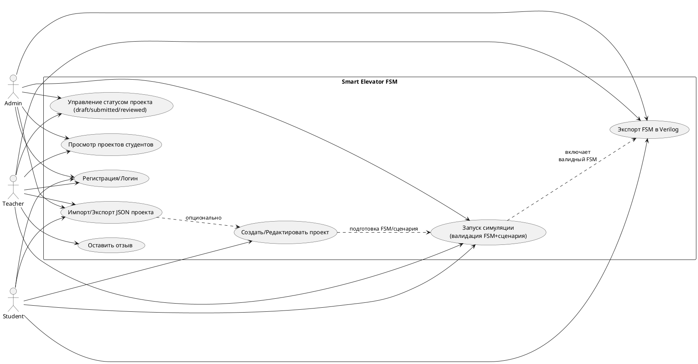

# Отчёт по проекту Smart Elevator FSM

## 1. Назначение и цели
- Разработать учебное приложение для моделирования работы лифта на основе конечных автоматов (FSM).
- Поддержать симуляцию сценариев, экспорт FSM в Verilog и проверку корректности/полноты автомата.
- Обеспечить разграничение ролей: студент — свои проекты; преподаватель/админ — любые.

## 2. Архитектура
- Backend: FastAPI, SQLAlchemy (PostgreSQL, JSONB для конфигов), Pydantic v2, Alembic.
- Frontend: React + TypeScript, Ant Design, React Query.
- Хранение: таблица `projects` с JSON config (elevator + fsm + default_scenario), поле `status` (draft/submitted/reviewed); таблица `users` с ролями (student/teacher/admin); `project_reviews`.

## 3. FSM и симуляция
- FSM (Mealy): `states` (id, is_initial), `transitions` (from/to, condition, event_type).
- Допустимые логические состояния лифта: `IDLE_CLOSED`, `DOOR_OPENING`, `DOOR_OPEN`, `DOOR_CLOSING`, `MOVING_UP`, `MOVING_DOWN`.
- Поддерживаемые условия переходов для экспорта/валидации: `*`/`always`, `call_received`, `arrived_at_floor`, `door_timer_expired`, `obstacle_detected`, `tick`.
- Симуляция: сценарий → внешние события → FSM → изменение состояния; движение этажей только в `MOVING_UP/MOVING_DOWN`; двери через `DOOR_OPENING/OPEN/CLOSING`.
- Валидация перед симуляцией/экспортом: единственное начальное состояние, уникальные id, существующие from/to, отсутствие «открытых дверей → движение» напрямую, покрытие событий сценария, поддерживаемые условия.

## 4. API (ключевые точки)
- `POST /auth/login`, `POST /auth/register`.
- `GET /users/me` — профиль (id, email, full_name, role).
- `GET /projects`, `GET /projects/my`, `POST /projects`, `PUT /projects/{id}`, `POST /projects/import`, `GET /projects/{id}/export`.
- `POST /projects/{id}/simulate` — симуляция (при ошибке валидации HTTP 400 с detail/errors).
- `POST /projects/{id}/fsm/export` — генерация Verilog при валидном FSM.
- `POST/GET /projects/{id}/reviews` — отзывы (преподаватель).

## 5. Фронтенд
- Экспорт JSON/FSM в Verilog, запуск симуляции, просмотр таймлайна и анимации.
- Авторизация с хранением токена в localStorage и автоматическим подтягиванием `/users/me`.
- Русифицированный интерфейс, таблицы проектов, редактор FSM/сценария, модалка Verilog.

## 6. Тестовые данные (пример импорта)
См. файл `REPORT.md` (раздел ниже) или используйте рабочий пример:
```json
{
  "name": "Лифт 10 этажей — тестовый проект",
  "status": "draft",
  "config": {
    "elevator": { "floors": 10, "door_time": 1, "move_time": 1, "capacity": 8 },
    "fsm": {
      "type": "mealy",
      "states": [
        { "id": "IDLE_CLOSED", "is_initial": true },
        { "id": "DOOR_OPENING", "is_initial": false },
        { "id": "DOOR_OPEN", "is_initial": false },
        { "id": "DOOR_CLOSING", "is_initial": false },
        { "id": "MOVING_UP", "is_initial": false },
        { "id": "MOVING_DOWN", "is_initial": false }
      ],
      "transitions": [
        { "id": "t_idle_call_up",   "from_state_id": "IDLE_CLOSED",  "to_state_id": "MOVING_UP",    "condition": "call_received" },
        { "id": "t_idle_call_down", "from_state_id": "IDLE_CLOSED",  "to_state_id": "MOVING_DOWN",  "condition": "call_received" },
        { "id": "t_arrive_up",      "from_state_id": "MOVING_UP",    "to_state_id": "DOOR_OPENING", "condition": "arrived_at_floor" },
        { "id": "t_arrive_down",    "from_state_id": "MOVING_DOWN",  "to_state_id": "DOOR_OPENING", "condition": "arrived_at_floor" },
        { "id": "t_opening_done",   "from_state_id": "DOOR_OPENING", "to_state_id": "DOOR_OPEN",    "condition": "always" },
        { "id": "t_open_timeout",   "from_state_id": "DOOR_OPEN",    "to_state_id": "DOOR_CLOSING", "condition": "door_timer_expired" },
        { "id": "t_closing_done",   "from_state_id": "DOOR_CLOSING", "to_state_id": "IDLE_CLOSED",  "condition": "always" }
      ]
    },
    "default_scenario": {
      "name": "Default scenario",
      "events": [
        { "time": 0,  "floor": 8,  "direction": "up",   "type": "call" },
        { "time": 8,  "floor": 10, "direction": "up",   "type": "call" },
        { "time": 20, "floor": 1,  "direction": "down", "type": "call" }
      ]
    }
  }
}
```

## 7. Проверка и тестирование
- Alembic миграции: создать колонку `projects.status` (enum draft/submitted/reviewed).
- Backend: unit-тесты валидации FSM/сценария, симуляции, прав доступа; проверка HTTP 400 при ошибках.
- Frontend: e2e сценарии авторизации, импорта/экспорта, запуска симуляции, просмотра Verilog.

## 8. Безопасность и доступ
- JWT, `get_current_user`, `get_current_teacher`.
- Студент видит/симулирует только свои проекты; преподаватель/админ — любые.

## 9. Дальнейшие шаги
- Добавить статусы workflow на фронте (кнопка “Отправить на проверку”, “Принять/Отклонить” для преподавателя).
- Расширить условия FSM и событий сценария (поддержка дополнительных сигналов) с валидацией.
- Дописать автотесты и документацию по API (OpenAPI/Swagger уже доступен по FastAPI).

## 10. Диаграмма вариантов использования (PlantUML)

